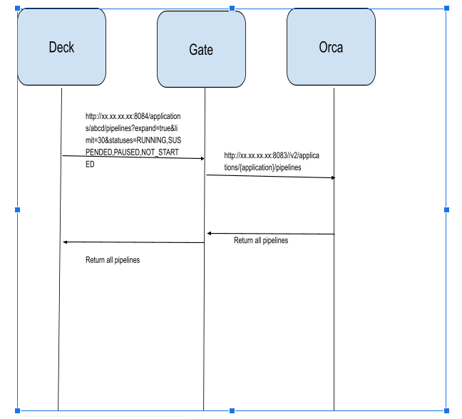
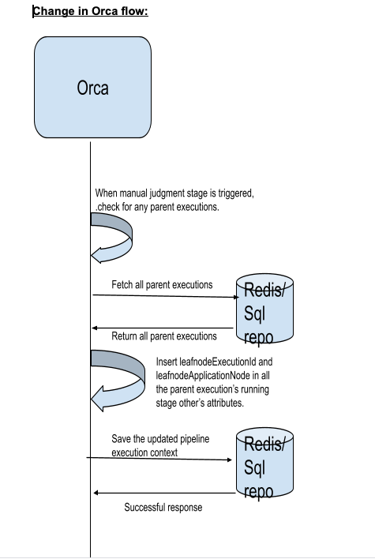
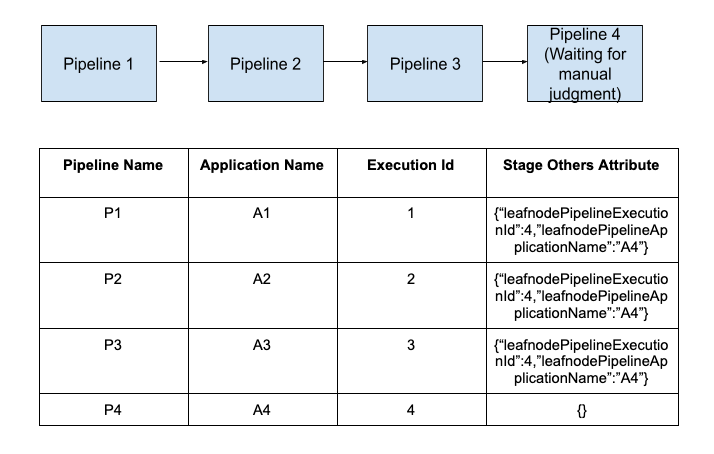
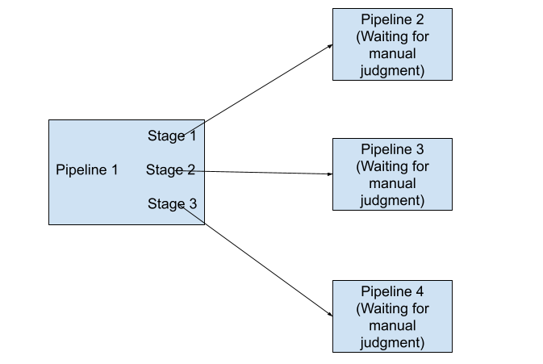
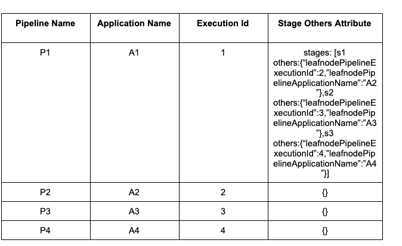

# Manual Judgement Navigation Enhancement Backend API Implementation

| | |
|-|-|
| **Status**     | _**Proposed**, Accepted, Implemented, Obsolete_ |
| **RFC #**      | https://github.com/spinnaker/governance/pull/195 |
| **Author(s)**  | Sanjeev Thatiparthi (@sanopsmx) (https://github.com/sanopsmx)
| **SIG / WG**   | sig-security
| **Obsoletes**  | _<RFC-#s>, if any, or remove header_ |

## Overview

If there are many pipelines it may be difficult for the user to serially check all the pipelines that are waiting for
manual judgement. So we need a functionality which will filter out all the pipelines that require manual intervention.

To implement such a feature we added a stage filter ( Manual Judgement ) that filters the pipelines based on if any of
the pipelines are waiting on manual judgement also add a visual notification for the stages that are waiting on manual
judgement and on clicking on these stages will take you to the leaf child of the pipeline stage which is actually
waiting on the manual judgement.

### Goals and Non-Goals

Spinnaker supports complex workflows that can be split into reusable chunks of workflows (pipelines) that can be used as
part of one top level workflow (pipeline) with each of the dependent workflows as a pipeline stage (child pipeline).
When this structure is used with a dependent sequence of pipeline stages in child workflows, they form a tree structure
with navigating to the currently executing pipeline requiring multiple steps. When a dependent pipeline is waiting on
manual judgement, it poses two usability problems - one is that there is no indication that a child pipeline is waiting
on manual judgement, and two is that it takes multiple clicks to reach the child pipeline depending on the number of
children.

The requirement is to simplify the navigation process when a child pipeline in the tree is waiting for manual judgement.
If a pipeline is waiting on a manual judgement stage then a single click on any of the parent pipelines that are waiting
for the child pipeline to complete, should navigate to the pipeline waiting for manual judgement even if the waiting
pipeline is not an immediate child.

## Motivation and Rationale

If there are many pipelines it may be difficult for the user to serially check all the pipelines that are waiting for
manual judgement. We need an Easy way to filter for pipelines waiting on Manual Judgment.

If we have a pipeline that is waiting on manual judgement then all the other pipelines that are waiting for this
pipeline to be executed will be in the waiting stage. Clicking on any of the waiting stages will directly take you to
the pipeline waiting on manual judgment.

## Timeline

Implementation is done.

## Design

Current Spinnaker implementation API only supports navigating to the immediate child pipeline with the metadata
available in the context of the pipeline. To support navigation to the pipeline that is more than one level deep in
the execution dependency tree structure, a new metadata needs to be created in the pipeline context to hold the leaf
pipeline in the execution tree. Since we are primarily interested in manual judgement navigation, the design will only
support the single click navigation to the leaf pipeline only if the leaf pipeline is currently waiting in the manual
judgement stage. All other conditions will only navigate to the immediate child pipeline as is the case with current
implementation.

Deck code will be updated to examine the new metadata added to the “pipeline” stage in the executions of all pipelines.
If a user clicks on the pipeline stage with the new metadata field then the user will be navigated to the pipeline
currently waiting for manual judgement. If the field is absent then the user will be navigated to the child pipeline
represented by the “pipeline” stage.

For optimal performance of this new feature implementation, additional processing will only be performed when Orca task
execution enters or exits the Manual Judgement stage of any pipeline. This will ensure that there is no additional
processing when users request pipeline execution information thus making performance impact on number of users or
user actions on the GUI negligible.

The change in the design is as follows:
When Orca enters a “Manual Judgement” stage (call this leaf pipeline), it triggers navigation for parent pipelines
The walk for parent pipelines is a linear walk. For each parent pipeline, the “pipeline” is the current execution stage
for the pipeline in the pipeline stage of parent pipeline, a new metadata referring to the leaf pipeline is added with
the execution id of the leaf pipeline. The walk ends when it reaches a pipeline that is not executed by another pipeline.
This is referred to as root pipeline.

When Deck fetches pipeline executions, it will process the pipeline for additional metadata in “pipeline” stage
If the metadata exists then the “pipeline” stage is displayed as “Manual Judgement”, else no change
When user clicks on stage with “Manual Judgement” then the user is navigated to the pipeline represented by the
execution ID set in the “Pipeline” stage.

Here is the flow diagram of the interaction from Deck. There is no change in this flow.

Change in Orca flow:

We will be adding two additional attributes “leafnodePipelineExecutionId”, ”leafnodePipelineApplicationName” in the

“pipeline execution’s trigger other parameters map object” attribute(see the below rest api).

Similarly, when a manual judgement is complete, using the same process the additional attributes are removed.

When the pipeline enters the ‘Running’ manual judgment stage, we check for parent execution id in the pipeline execution
context’s trigger object. If it exists, we fetch all the parent pipeline execution context from the manual judgment
stage and update it with leafnode pipeline execution id and application name and store them to the underlying database.
We get this leafnode pipeline execution id(manual judgment execution id), application name(manual judgment stage
application name) and assign to the pipeline context’s trigger object’s others map object as
“leafnodePipelineExecutionId”:”01F1D72066T9GVTSSKC30X8Z3P”, “leafnodePipelineApplicationName”: “testdemo”.
From the next rest api call(below), the updated pipeline execution is sent to the UI and displayed accordingly.

Note :- flag to enable/disable manual judgment navigation in orca-local.yml.

	spinnaker:
 	   manual-judgment-navigation: true/false

**Sample Test Case:**

**Rest API:**

http://xx.xx.xx.xx:8084/applications/abcd/pipelines?expand=true&limit=30&statuses=RUNNING,SUSPENDED,PAUSED,NOT_STARTED

**Rest API Output:**

[
{
"type": "PIPELINE",
"id": "01F1D72066T9GVTSSKC30X8Z3P",
"application": "siddhu1",
"name": "test-demo3",
"buildTime": 1616425059053,
"canceled": false,
"limitConcurrent": true,
"keepWaitingPipelines": false,
"stages": [
{
"id": "01F1D720QD02B37K4Q4GT066EZ",
"refId": "1",
"type": "wait",

        "name": "Wait",
        "startTime": 1616425059770,
        "endTime": 1616425062901,
        "status": "SUCCEEDED",
        "context": {
          "waitTime": 3
        },
        "outputs": {},
        “others”: { “leafnodePipelineExecutionId”:”01F1D72066T9GVTSSKC30X8Z3P”,
      “leafnodePipelineApplicationName”:”testdemo”}
        "tasks": [
          {
            "id": "1",
            "implementingClass": "com.netflix.spinnaker.orca.pipeline.tasks.WaitTask",
            "name": "wait",
            "startTime": 1616425059883,
            "endTime": 1616425062838,
            "status": "SUCCEEDED",
            "stageStart": true,
            "stageEnd": true,
            "loopStart": false,
            "loopEnd": false
          }
        ],
        "requisiteStageRefIds": []
      },
      {
        "id": "01F1D720QDM7B9ZTTG8Q0G0B52",
        "refId": "2",
        "type": "manualJudgment",
        "name": "Manual Judgment",
        "startTime": 1616425062984,
        "status": "RUNNING",
        "context": {
          "judgmentInputs": [],
          "failPipeline": true,
          "notifications": []
        },
        "outputs": {},
        "tasks": [
          {
            "id": "1",
            "implementingClass": "com.netflix.spinnaker.orca.echo.pipeline.ManualJudgmentStage.WaitForManualJudgmentTask",
            "name": "waitForJudgment",
            "startTime": 1616425063008,
            "status": "RUNNING",
            "stageStart": true,
            "stageEnd": true,
            "loopStart": false,
            "loopEnd": false
          }
        ],
        "requisiteStageRefIds": [
          "1"
        ]
      }
    ],
    "startTime": 1616425059638,
    "status": "RUNNING",
    "authentication": {
      "user": "sanjeev@opsmx.io",
      "allowedAccounts": []
    },
    "origin": "api",
    "trigger": {
      "type": "manual",
      "user": "sanjeev@opsmx.io",
      "parameters": {},
      "artifacts": [],
      "notifications": [],
      "rebake": false,
      "dryRun": false,
      "strategy": false,
      "resolvedExpectedArtifacts": [],
      "expectedArtifacts": [],
      "executionId": "01F1D72066T9GVTSSKC30X8Z3P",
      "eventId": "573eda57-eeed-48ea-9e58-a5aa046e994e",
      "enabled": false,
      "preferred": false
    },
    "pipelineConfigId": "268d2757-7e71-4eef-838d-3b3a4aff9a6b",
    "notifications": [],
    "initialConfig": {},
    "systemNotifications": [],
    "spelEvaluator": "v4"
}
]

### Dependencies

Implemented for both redis and sql storage.
