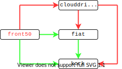

# Consolidated Spinnaker Build System

|               |                                                         |
| ------------- | ------------------------------------------------------- |
| **Status**    | In-Process                                              |
| **RFC #**     | [154](https://github.com/spinnaker/governance/pull/154) |
| **Author(s)** | Michael Plump ([`@plumpy`](https://github.com/plumpy))  |
| **SIG / WG**  | Platform SIG                                            |

## Overview

This document describes a new versioning scheme and build system for Spinnaker.

### Goals and Non-Goals

This document describes:

- changes to the versioning schemes for artifacts and Spinnaker itself
- a technical description of the build system that will implement these changes
- how this new build system will interact with the Jenkins-based end-to-end
  tests

This document does not describe any changes to the end-to-end tests, aside from
how they interact with the build system. While we would like to eventually move
these tests into the GitHub Actions CI system and retire Jenkins, that will be a
separate RFC.

It also does not describe any major changes to the way Deck is built. We will
continue to build it with Gradle using the same infrastructure as all the other
microservices. Since Deck is markedly different from the rest of the
microservices, changing its build system
[has been a topic of discussion recently](https://docs.google.com/document/d/1ch0wEUNlQwvjAn8ob_HPZ54jYbmmloe2AKbtMRI_JsU/edit?usp=sharing),
but is not in scope for this document.

It doesn't discuss changes to the Halyard and Spin release process.

## Motivation and Rationale

Currently there are two separate build systems for Spinnaker. These systems
build the same code, but publish their artifacts to different artifact
repositories using different version numbers. This is redundant and confusing.
This document aims to describe a single build system for all community
artifacts.

One system is orchestrated via GitHub Actions and is used for cross-repository
dependencies. For example, when `gate` code depends on `fiat` code, the jars for
that dependency are generated by these builds. This system is also used by the
plugin system for versioning the plugin APIs.

The other system is used for the artifacts we distribute to the community:
Docker containers and Debian packages. This system runs in Jenkins and is a
complicated mash-up of Jenkins and Google Cloud Build configuration, shell
scripts, Python, and Kotlin. Some of it is checked-in and some of it just lives
in Jenkins configs or files on the Jenkins server.

These build systems are mostly unaware of each other. They use different version
numbering schemes, but with identically-shaped version numbers. For example, in
the past year, they've each generated an echo 2.12.0, but those two 2.12.0s
aren't related to one another in any way. Their git tags are slightly different
(`v2.12.0` vs. `version-2.12.0`) and their artifacts are published to different
Bintray repositories, so there are no conflicts. (Yes, we also have two
different Bintray repositories.)

## Timeline

This build system will be implemented between the 1.22 release in mid-August and
the following release (which will no longer be called 1.23) in mid-October.

## Design

### New Versioning Scheme and Release Schedule

Spinnaker releases will switch to date-based versions, so instead of 1.23, we
will call it 2020.4. The release schedule will change from every 8 weeks to
every 3 months.

Anecdotally, we believe that some users expect that there won't be any breaking
changes between 1.20 and 1.21, perhaps confusing Spinnaker versions with
[SemVer](https://semver.org/). In fact, we regularly introduce breaking changes
in these releases.

Additionally, this new version scheme will help users know how old their
Spinnaker version is; we know many users are running very old versions of
Spinnaker and this may goad them into upgrading more frequently.

A third, lesser advantage of date-based versions is that it makes a clear break
from microservice versions of the past. For example, there is already an Orca
1.22.0 in one of the old version schemes.

The release branches will be cut on the second Wednesday of the quarter, and the
release will be targeted for the following Wednesday. (These dates were chosen
to avoid major US holidays.) The time between releases will now be either 13 or
14 weeks, depending on the calendar. The next releases will be:

- 2020.4: branches cut 2020-10-14, release on 2020-10-21
- 2021.1: branches cut 2021-01-13, release on 2021-01-20
- 2020.2: branches cut 2021-04-14, release on 2021-04-21
- 2020.3: branches cut 2021-07-14, release on 2021-07-21

Slowing the release cadence reduces the release manager overhead somewhat,
although release manager shifts are now longer and may have to be shared by
multiple people. It also helps many of our users who find upgrading to be a lot
of work by reducing how frequently they have to upgrade. It does mean it takes
longer to get new features into their hands, however.

**_Alternatives:_**

- don't change the current Spinnaker version scheme (this decision really has
  nothing to do with the rest of the RFC; the build system described here will
  work with the existing Spinnaker versioning scheme too).
- Use versions of YYYY.MM, where MM is the month. This makes it even more clear
  when the release is from, but it looks a little weird with a patch release
  (2020.07.3). It's also confusing since the first and last components of the
  version increment by one, whereas the middle component changes by some other
  interval.
- Release more often. Release less often. Release every day?

### Affected Repositories

This new versioning scheme affects all repositories in the Spinnaker
organization that are involved with the community release:

- the 11 microservices: `clouddriver`, `deck`, `echo`, `fiat`, `front50`,
  `gate`, `igor`, `kayenta`, `orca`, `rosco`, and `spinnaker-monitoring`
- the Java libraries: `keiko`, `kork`, and `moniker`

Sometimes this document refers to "the Java microservices", which is all the
microservices except `deck` and `spinnaker-monitoring`. Most of this document
concerns only "the Java repositories", which refers to the Java microservices
plus the Java libraries.

None of the changes in this document concern the `spinnaker-gradle-project`
repository.

### Java Monorepo

All the Java repositories will be merged into a single monorepo called
`spinjava` using [`monorepo-tools`](https://github.com/shopsys/monorepo-tools).
A test version of the repository described here
[is available at `plumpy/spinjava`](https://github.com/plumpy/spinjava). The
script used to generate it
[is included as an appendix](#appendix-a-script-to-generate-the-monorepo).

For simplicity of implementation, each existing repository will be placed into a
directory inside this new, larger repo. We will then use
[Gradle composite builds](https://docs.gradle.org/current/userguide/composite_builds.html)
to tie these repositories together. There will be no `build.gradle` file in the
root directory.

You can already test this approach by editing
[`orca/gradle.properties`](https://github.com/spinnaker/orca/blob/master/gradle.properties)
and setting `korkComposite` to true. We will simply flip the default behavior,
so that a composite build is the default and a `korkVersion` can be specified to
revert to downloading a previously-built artifact.

Only the required dependent modules will be built. For example, `front50` has a
dependency on `clouddriver`, but building `front50` doesn't require building
_all_ of `clouddriver`. You just need to build the `clouddriver-google-common`
module.

Caching works as you'd expect: if you build `orca` followed by `fiat`, you will
only have to compile each `kork` module once.

This monorepo requires you to change all affected Java code in a single PR; no
longer will you commit code to `kork` only to find out later it broke
compilation of a handful of microservices.

**_Alternatives:_** I also wrote a description of a build system that doesn't
use a monorepo. It's significantly more complicated, but I
[included it in an appendix](#appendix-an-alternative-multi-repo-workflow).

### CI Builds

For continuous integration, we will use GitHub Actions. A separate job will be
launched for every sub-project. These jobs will first use
[a custom action to determine whether or not that project needs to be rebuilt](#requires_build)
(roughly: did any files in the project or any of its dependencies change?). If
not, we'll just declare the build a success. If so, we'll do a complete build of
the project.

Since these jobs run in parallel, building all of them (if required) takes only
as long as the slowest project (which is `clouddriver`, at about 20 minutes).

**_Alternatives_**: I looked at using a single CI job that would build the
projects in serial, but it took too long. A change to `kork` required over an
hour of building.

### Maven Artifact Publishing

Twice a week, via a scheduled GitHub Action, we will run a build that publishes
Maven artifacts. These aren't used by our builds anymore, but can be used by
projects that want to depend on a recent, unreleased version of the Java
microservices. For example, `halyard` will use these artifacts, as will users
developing plugins for the next version of Spinnaker.

Artifacts will be identified by the branch, commit timestamp (in UTC), and short
SHA (seven digits). They'll look like this: `2020.4-20200601.193201-198aa21`.

Commit timestamps aren't guaranteed to increase monotonically, so technically
Maven won't always sort these versions correctly. If, for example, you're
developing a plugin and add a dependency on the latest version of echo, you may
not resolve the _actual_ latest version. Because we generally use squash
commits, however, this shouldn't affect us much.

The advantage of using commit timestamp (instead of build timestamp) is that you
can determine the name of an artifact using only the branch and commit log; if
we used build time, you'd have to list all the artifacts in the repository and
try to match the short SHA.

On master, the first part of the artifact version ("2020.4") will be determined
by looking at the existing branches and calculating the expected next release.
If the latest release branch is `release-2021.2.x`, we'll use 2021.3 for the
main artifact version.

### Releases

GitHub Actions workflows are primarily triggered by events on a GitHub
repository. To facilitate triggering these workflows, we will create a
`spinnaker/release-operations` repository. Various actions will be performed on
this repository to launch the release-related workflows. Write access to this
repository will be limited to the `release-managers` GitHub team, so only those
members will have access to launch the workflows.

#### Create Release Branches

To create the release branches for a Spinnaker release, a release manager will
create a branch in the `release-operations` repository. The commit used for the
branch is ignored. We will continue to use the same release branches we do now:
a 2020.4 release is backed by a branch named `release-2020.4.x`.

Creating a `release-*` branch triggers a workflow that will create a branch with
the same name in all release-relevant repositories.

#### Create a Testing Release

To create a Spinnaker release for testing, tag a commit in the
`release-operations` repository. The commit being tagged is ignored. The tag
should start with a branch name like `master-*` or `release-2020.4.x-*`.
Generally speaking, these will be date-based: `master-20200614-220719`. (Using a
tag to trigger a release is admittedly weird, but it will generally only be done
via a Jenkins job and will go away entirely when we eventually remove Jenkins.)

It will trigger a build on all 11 microservices to publish Debian and Docker
images to the artifact repository. Once all those builds have succeeded, the BOM
will be published and containers tagged with this release version.

#### Publishing a Release

To publish a release of Spinnaker, a release manager will create a GitHub
release in the `release-operations` repository. The tag used for the release is
the testing release that will be published.

All published artifacts from the testing release will be updated with the new
version:

- BOM (for Halyard deployments): The existing BOM will be copied, with the
  included `version` field updated to reflect the new version number.
  (Deployments that aren't using Halyard will just fetch the containers
  directly, but the BOM will continue to be written until Halyard is no longer a
  supported tool.)
- Debian: a build will be triggered in each microservice repository at the
  appropriate commit and with the new version number
- Docker: the existing containers for each microservice will be tagged with the
  new version numbers
- [Halyard configuration snippets](https://console.cloud.google.com/storage/browser/halconfig):
  these will be copied to the new version numbers
- Maven: a build will be triggered in each Java repository at the appropriate
  commit and with the new version number to publish the official jars to Maven.

Finally, we will add git tags to each repository and update the
[`versions.yml`](https://console.cloud.google.com/storage/browser/halconfig/versions.yml)
file (which lists the current non-deprecated versions of Spinnaker).

## Implementation: Custom GitHub Actions

The [`spinrel`](https://github.com/spinnaker/spinrel) tool is a Kotlin CLI
invoked by Jenkins. The code has much of the functionality we need for the
release system, so we will repurpose it to host the GitHub Actions needed for
the new system.

#### requires_build

This action builds a dependency graph of the specified project. It will do this
either by inspecting the various `settings.gradle` files or with a custom Gradle
plugin. (The former is easier but hackier. A custom plugin would be less
error-prone, but requires running Gradle to get the graph.)

When run against the `clouddriver` project, for example, it would note
dependencies on `fiat`, `kork`, and `moniker`.

It will then inspect the list of changed files in the commits under
consideration. If there are any files changed in `clouddriver/…`, `fiat/…`,
`kork/…`, or `moniker/…` the action will output `true`. Otherwise it will output
`false`. A `true` output will require the project to be built (in a subsequent
build step).

A potential future improvement is to build a _full_ dependency graph of project
modules, so that (for example) we won't rebuild `fiat` if only files in
`kork/kork-sql` changed, since `fiat` doesn't use that module.

**_Alternatives:_** Gradle has support for
[a remote build cache](https://docs.gradle.org/current/userguide/build_cache.html).
If we set up a well-configured remote build cache (populated by the post-commit
build job), we could possibly remove this action and just run all 11 build steps
in every PR build.

#### create_release_branch

This is triggered when a branch is created in the `release-operations`
repository. It simply creates a branch in all the release-relevant repositories.

#### create_test_release

This is triggered by creating a tag in the `release-operations` repository.

It looks up the most recent commits in each of the microservice repositories
(`deck`, `spinnaker-monitoring`, and `spinjava`) that had successful CI
post-merge builds. It uses
[repository dispatch](https://help.github.com/en/actions/reference/events-that-trigger-workflows#external-events-repository_dispatch)
to trigger a workflow that lives in each of those repositories.

These workflows rebuild the project to produce new Debian and Docker artifacts,
as well as publish
[the microservice configuration snippets used by Halyard](https://console.cloud.google.com/storage/browser/halconfig).
The version numbers used for Docker tags will be calculated
[the same way as Maven version numbers](#maven-artifact-publishing). Debian
version numbers will have `-1` appended, to represent the
[debian revision](https://www.debian.org/doc/debian-policy/ch-controlfields.html#s-f-version).
Since all the commits have previously passed CI, tests will be disabled with
`-x test`.

It will monitor these workflows and, if they are all successful, it will publish
the BOM.

#### publish_release

This is triggered when a GitHub release in the `release-operations` repository.
The tag used for the release is the testing release that will be published.

The functionality of this is pretty well described in the
[Publishing a Release](#publishing-a-release) section.

The workflows that publish the Halyard configs, and Debian and Maven artifacts
are the same ones used by
[the `create_test_release` action](#create_test_release). An extra flag will be
sent in the repository dispatch payload to identify this as an official release
build, which triggers building the Maven artifacts. (Maven artifacts aren't
published during test release builds.)

This action will watch all the builds, waiting for them to succeed before moving
on to publishing the BOM at its new location.

## Jenkins Integration

The end-to-end tests will create a tag in the `release-operations` repository.
It will then look up the triggered workflow and wait for it to succeed. If it
does, it will begin the end-to-end tests, telling Halyard to deploy the version
it just tagged. (This replaces most of the current `Build_PrimaryArtifacts`
flow.)

## IntelliJ integration

Since each subdirectory is its own Gradle project, IntelliJ can just open that
subdirectory directly. It handles this gracefully and will automatically add any
dependency directories to the project (but not sub-dependencies). IntelliJ is
already indexing the source for our Spinnaker dependencies, so this shouldn't
add any overhead.

Additionally, we will create
[an `intellij` subdirectory](https://github.com/plumpy/spinjava/tree/master/intellij)
that you can open to see _all_ the source in a single project, if you have a
hardy enough computer.

## Prior Art and Alternatives

An alternative to the monorepo would be to maintain our many repositories but
try to keep all the Java repository versions in sync. This is _significantly_
harder, but I detailed that approach in
[an appendix below](#appendix-an-alternative-multi-repo-workflow). I wrote it
first, felt exhausted by the cognitive overhead of the whole thing, and decided
to propose this much, much simpler monorepo version instead.

## Risks

Flaky tests become significantly more expensive because they're run more often.
We'll have to police those more aggressively. For example, I believe there's one
in `orca` we've been ignoring for a while. It will now be triggered whenever you
make a change in `kork`, `keiko`, `fiat` too.

The old releases will continue to build on the discrete repositories.
Cherrypicks to these old releases will be painful. I think in a few days we
could build some command-line tooling to do these cherrypicks. It won't be super
seamless, but it's a temporary problem and I don't think we should spend more
time than that on it.

… I'm sure there's more I'm not thinking of.

## Future Possibilities

Eventually, we'd like to remove the end-to-end tests and replace them with
integration tests that could be run at CI time. This would remove the
[Create a Testing Release](#create-a-testing-release) step.
[Publishing a Release](#publishing-a-release) would just publish the latest
versions of all microservices on a branch.

## Appendix: A script to generate the monorepo

The following script was used to generate the
[`plumpy/spinjava` repository](https://github.com/plumpy/spinjava). I included
it mostly to show how straightforward the conversion is.

Note that it's a [`fish`](https://fishshell.com) script, _not_ `bash`.

```fish
#!/usr/bin/fish

set -l files (ls -A)
if not test -z "$files"
  echo "This must be run in an empty directory."
  exit 1
end

set repositories \
  clouddriver echo fiat front50 gate igor kayenta keiko kork moniker orca rosco

git init

for repo in $repositories
  git remote add $repo http://github.com/spinnaker/$repo.git
end
git fetch --all --no-tags
~/dev/monorepo-tools/monorepo_build.sh $repositories

# Uncomment all the "fooComposite=true" lines
for repo in $repositories
  sed -i -E 's/^#([a-z]+Composite=true)/\1/' $repo/gradle.properties
end

# Kayenta doesn't have the composite settings added to its gradle.properties
echo "includeBuild '../keiko'"   >> kayenta/settings.gradle
echo "includeBuild '../orca'"    >> kayenta/settings.gradle

# Moniker has been included via spinnaker-dependencies, so doesn't have
# composite flags
echo "includeBuild '../moniker'" >> kork/settings.gradle
echo "includeBuild '../moniker'" >> front50/settings.gradle
echo "includeBuild '../moniker'" >> clouddriver/settings.gradle
echo "includeBuild '../moniker'" >> orca/settings.gradle

git commit -a -m "set up every composite build"

mkdir intellij
cd intellij
../kork/gradlew wrapper
echo "org.gradle.jvmargs=-Xmx1g" >> gradle.properties
echo ".gradle" >> .gitignore
echo ".idea"   >> .gitignore
echo "rootProject.name='spinjava-intellij'" > settings.gradle
for repo in $repositories
  echo "includeBuild '../$repo'" >> settings.gradle
end
cd ..
git add intellij

git commit -a -m "add a master intellij project"
```

## Appendix: An Alternative Multi-Repo Workflow

### Commit

For simplicity, every commit to a Java repository will build and publish
artifacts to the associated Maven repository. The versions will be exactly the
same [as described in the monorepo section](#maven-artifact-publishing).

These artifacts are intended to be consumed in two ways:

- cross-repository dependencies
- developing plugins targeting future Spinnaker releases

We will _not_ publish Debian and Docker artifacts at every commit.

### Cross-Repository Dependencies on `master`

A workflow for bumping dependencies across the Java repositories will run every
Sunday, Tuesday, and Thursday night on the `master` branch. This workflow will
also have a webhook trigger. A script will be provided allowing anyone with
write permission to trigger the workflow.

The goal of this dependency bump is to leave the repositories in a
_version-consistent_ state. To be version-consistent, the full Java dependency
graph should contain only a single version of each repository. As a
counter-example, this graph is _not_ version-consistent since it contains two
different versions of `kork`:

```
clouddriver 1.2→fiat 2.3→kork 9.9
      └────────→kork 9.8
```

Unlike the rest of the workflows described in this document, this workflow will
also touch the `halyard` repository (and maybe `keel` and `swabbie`?).

### Releases

[As described in the monorepo section](#releases), release workflows are
triggered by actions on the `release-operations` repository.

#### Post-Commit Builds

On a release branch, unlike `master`, the Java repositories will constantly keep
their dependencies pointing to the latest code on the branch.

A post-commit build will consult the dependency graph and create PRs to bump the
versions on its downstream dependencies. For example, when `clouddriver`
finishes building, it will create a PR to put the newly-created artifact's
version into `front50/gradle.properties`.

As usual, these dependency bump PRs will be set to auto-merge if the tests pass,
which potentially triggers more version bump PRs until all the release branches
are referencing the latest commits on the branch.

#### Create Release Branches

Release branches are created
[just as they are in the monorepo section](#create-release-branches). After
creating each branch, however, this will also start
[a dependency bump workflow](#the-start_deps_update-action), to make sure all
the dependencies are referencing the latest commits. We also start
[the same dependency bump workflow](#the-start_deps_update-action) on master to
build artifacts with the new version number (i.e. if we just cut 2020.4, it will
start building artifacts for 2021.1).

#### Create a Testing Release

Testing releases are [the same as in the monorepo](#create-a-testing-release),
but with one additional check. On release branches, but _not on master_, this
will verify that all the dependencies in the Java repositories are pointing at
the latest commits. If not, the workflow will immediately fail.

#### Publishing a Release

This is entirely the same as
[the workflow described in the monorepo section](#publishing-a-release).

### Implementation

#### spinnaker-gradle-project

A method will be provided to determine a project's version from the git
repository. (Probably this will be a property which we set on the command-line,
like `-PcalulateVersionFromGit`.) It will consider the checked-out branch and
latest commit in the log to come up with the
[commit version](#maven-artifact-publishing) and apply it to the project.

It will also need to add a dependency on
[Gradle's built-in Maven Publish Plugin](https://docs.gradle.org/current/userguide/publishing_maven.html),
for publishing to Google Artifact Registry.

#### Java Dependency Graph Generation

The Java dependency graph will be generated at runtime by retrieving the
`gradle.properties` files of every configured repository. A hardcoded list of
property names will be used to add edges into the graph (`fiatVersion`,
`korkVersion`, etc.).

**_Alternatives_**: we could hardcode this, similar to what I did for `bumpdeps`
(where each repository contains a list of its dependents). In my tests, however,
I was able to generate this graph across all 18 repositories in under a second
(using 18 parallel HTTP requests). This does make it dependent on remote calls
to GitHub, but we already have a dependency on GitHub.

#### build.yml/release.yml

The standard `.github/workflows/build.yml` file we use in all repositories needs
to be tweaked to add various publishing flags and call the Maven artifact
publishing tasks. The `release.yml` file can be deleted.

#### Custom Actions

The custom actions described [in the monorepo section](#custom-actions) will all
be used here, along with some additional actions and changed behaviors.

##### The `bump_dependents` Action

This is triggered post-merge if the CI passes.

For builds on `master`, if the triggering commit does not include a change to
`gradle.properties` that changes a dependency (e.g. a change to the
`korkVersion` property), the action will simply exit. On a release branch, it
always runs.

It will be essentially the same as (and will make obsolete) the current
[`bumpdeps`](https://github.com/spinnaker/bumpdeps) action. In particular this
means:

- the `gradle.properties` file in the dependent repository is updated to
  reference the just-built artifact version
- if an open dependency bump PR exists, it will be reused, otherwise a new PR
  will be created
- the PR will automatically merge if the tests pass (via Mergify)
- if the tests fail, a review will be requested from `oss-approvers` on master
  or `release-managers` on a release branch

##### The `start_deps_update` Action

This action starts a waterfall of dependency bumps across the Java repositories.
It is triggered on `master` on a schedule. The workflow for this lives in the
`release-operations` repository. It is also run on a release branch after all
the branches are successfully created.

An explicit design goal of this workflow is that if a dependency bump fails,
once it is fixed the down-graph dependency bumps will continue. This makes it
resilient to compile-time errors introduced by API changes. This happens because
any change to dependency version in a `gradle.properties` file (whether it's
from an autobump PR or a manual bump) triggers the `bump_dependents` action.

When discussing "the base of the dependency graph", this is the set of
repositories that don't depend on any other repositories. In practice, this is
only `moniker`, so I will sometimes refer to it that way, but the code won't be
so specific.

Starting at the base of the dependency graph, we check to see if a Maven
artifact exists in the repository for the expected version number. If not, we
trigger a build. This catches the case where we have just created a new release
branch (e.g. for 2021.1) so we want to create artifacts with the new `master`
version (2021.2). We monitor the build and wait for it to succeed before
continuing. (If a correctly-versioned artifact does exist for `moniker`, we can
assume such artifacts exist for the rest of the repositories.)

Next we look at every edge in the dependency graph and mark any edges that are
stale (i.e. the target of the edge is an old version) as _to-be-updated_,
leaving the others as _will-not-update_. We then walk up the graph starting from
the base (`moniker`). As soon as we encounter a _to-be-updated_ edge, all edges
after that are marked _will-not-update_.

Consider the following graph, where red edges are stale and green are not:



In this case, we start at `kork`, since that's the base. After walking the graph
up from `kork`, the `clouddriver`→`fiat` and `clouddriver`→`kork` edges will be
marked _to-be-updated_. The `front50`→`clouddriver` edge, despite being red,
will be marked _will-not-update_ because it is a predecessor of two
_to-be-updated_ edges.

After deciding on the _to-be-updated_ edges, it will send PRs (exactly as
described in [the bump_dependents action](#the-bump_dependents-action)) to
update these edges. These PRs, upon merging, will generate more PRs to update
the predecessor edges. (On `master` this happens because any change to a version
in `gradle.properties` sends PRs to bump dependents. On release branches this
happens because _all_ merges trigger dependency bump PRs.)

In the previous example, once the PR that updates `clouddriver`'s dependency
versions is merged, a PR will be created for the `front50`→`clouddriver` edge.
That's why we don't update it initially.

**_Alternatives:_** I tried to walk a line between simplicity and correctness
here. But in the common case where `kork` is changed, this will result in 24 PRs
to the 10 dependent repositories. The `front50` and `orca` repositories get it
worst, with three separate commits.

One way to work around this is by doing our own orchestration inside the action.
We could trigger builds of things that _only_ depend on `kork` (`fiat`, `keiko`,
and `rosco`), wait for them to finish, then move on to things that only depend
on `kork`, `fiat`, `keiko`, and `rosco`, and continue working our way up the
graph. We would then have only 10 dependency bump merges. The biggest downside
is that if one of the dependency bump PRs fail, the action has to exit and wait
for someone to fix the build. We then have to start over from scratch, rather
than continuing where we left off. It's also a much more complicated chunk of
code.

Another option I came up with is a decentralized system that coordinates its
status through git tags and commit messages. It would be able to pick up where
it left off if a problem was encountered, but is even more complicated and
leaves a trail of tags in its wake.

Yet another option is working to flatten our dependency graph. If we only had
two levels of hierarchy, we could probably devise a simpler system. But if we
ever needed a deeper dependency graph later, we'd have to reimplement something
like the proposed solution. Flattening the graph helps the proposed solution
just as much, so it's still probably something we should try to do.

##### The create_release_branch Action

The workflow that runs this will also run
[the start_deps_update action](#the-start_deps_update-action) on the branch.

##### The publish_release Action

For Maven builds, we will _not_ commit changes to `gradle.properties`, instead
passing those properties on the command-line. So, for example, when building
`clouddriver` 2020.4.3, we will pass the following arguments to gradle:

```
-Pversion=2020.4.3 -PfiatVersion=2020.4.3 -PkorkVersion=2020.4.3
```

For Java repositories, this will have to happen in dependency-graph order, since
we can't build `clouddriver` with those flags until `fiat` and `kork` versions
have been published to the artifact repository.
