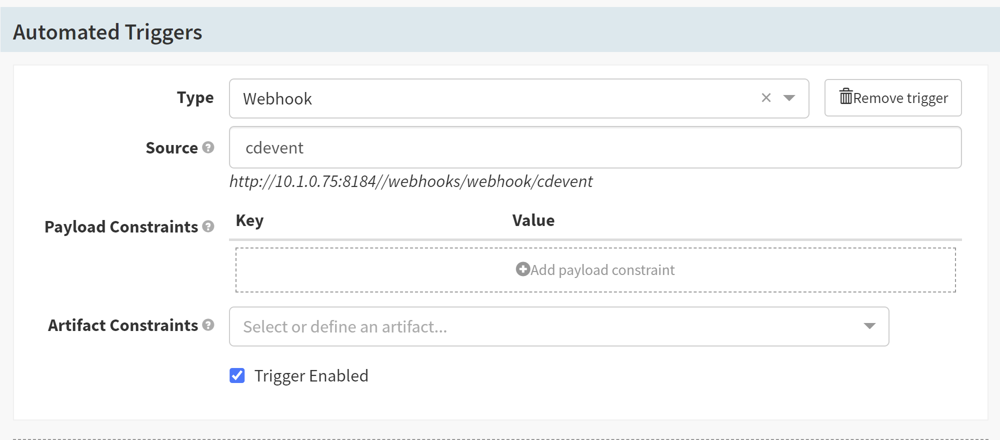
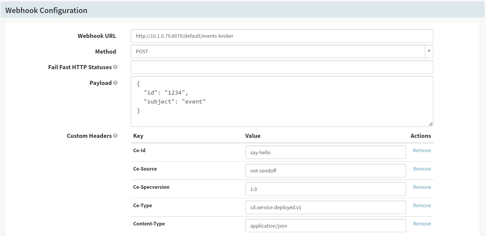

# Implementing CDEvents to Spinnaker using Java SDK


| | |
|-|-|
| **Status**     | _**Proposed**, Accepted, Implemented, Obsolete_ |
| **RFC #**      | _#299_ |
| **Author(s)**  | _Jalander Ramagiri (`@rjalander`)_|
| **SIG / WG**   | CDF-CDEvents, CDF-SIGEvents |

## Overview

Many organisations use more than one CI/CD tools as part of their pipelines and most of the times the organisations implement their own glue code in order to make the tools work with each other.

Implementing [CDEvents](https://cdevents.dev/) to Spinnaker enables Spinnaker to communicate with other CI/CD tools with in the ecosystem. [CDEvents](https://cdevents.dev/) is a common specification for Continuous Delivery events based on CloudEvents.
Spinnaker can produce and consume [CDEvents](https://cdevents.dev/) using [Java SDK](https://github.com/cdevents/sdk-java) which is developed and maintained by the [CDEvents community](https://cdevents.dev/community/).

## Goals and Non-Goals
Goals:
- Event-Driven Standardization with CI/CD tools like Keptn, Tekton, Jenkins, Spinnaker, etc..
- Using an existing Webhook and Pub/Sub Automated triggers Spinnaker can able to consume and produce CDEvents from/to `events-broker`
- One needs to subscribe to `events-broker` with the type of event that needs to be consumed by Spinnaker

Non-Goals:
- Creation of API end points to produce and consume CDEvents

## Motivation and Rationale

- Currently there is no common specification for CI/CD tools to communicate with in the CI/CD ecosystem. 

- In a complex and fast-moving CI/CD world with a lot of different tools and platforms that need to communicate with each other.

- Multiple pipelines can be run between CI/CD tools by sharing the artifacts and its metadata.

- Increase in traceability with in the ecosystem from commit to deployment of an artifact.

- Operators can deploy Spinnaker with `CDEvents` to run multiple pipelines using different CI/CD tools in ecosystem.

## Timeline
Proof of concept with Spinnaker, Keptn and Tekton CI/CD tools developed to communicate with each other about occurrences and running pipelines from building an artifact to deploy.

The CDEvents integration process will be achieved in two Goals:
Goal-1 : Introducing CDEvents to Spinnaker using Spinnaker-Webhooks
Goal-2 : Integrating CDEvents to Spinnaker using Spinnaker Pub/Sub Automated triggers type(google,amazon) and Notifications

The final implementation aligning with `CDEvents` vocabulary specification will take from 4-6 weeks.

## Design

CDEvents is build upon CloudEvent, the event received will be in CloudEvent format with additional CI/CD specific extensions added to it.
CDEvent specifications can be found [here](https://cdevents.dev/)

The CDEvents integration process will be achieved in two Goals:
### Goal-1 : 
Introducing `CDEvents` to Spinnaker using Spinnaker-Webhook:

Using an existing Spinnaker Webhook `CDEvents` will be consumed/produced and Spinnaker can communicate with other CI/CD tools using CDEvents.

### Consume CDEvents:

A Source `cdevent` will be configured for Webhook type Automated triggers from Spinnaker dashboard.
The URL `http://<HOST>:8184//webhooks/webhook/cdevent` formed will be placed as subscriber uri to the `events-broker` with specific event type to receive.

Example: A sample event `dev.cdevents.artifact.published` subscribed to knative `events-broker`
``` 
kubectl create -f - <<EOF
apiVersion: eventing.knative.dev/v1
kind: Trigger
metadata:
  name: cd-artifact-published-to-spinnaker
spec:
  broker: events-broker
  filter:
    attributes:
      type: dev.cdevents.artifact.published
  subscriber:
    uri: http://<spin-gate-service>:<port>/webhooks/webhook/cdevent
EOF 
```
A pipeline will be triggered for which Webhook Automated trigger is configured as below:


 
 Note: An additional validation is required to be added to the above Webhook configuration to include Attribute Constraints for triggering the pipeline only when a specific event type is received.
 Event type is included as `ce-type` in the HTTP Header part of the event consumed
 

### Produce CDEvents

A new Webhook stage will be configured in a pipeline from which we need to send a CDEvent
 
 

The CDEvent will be received by a `events-broker` configured as Webhook URL.

With this existing Webhook configuration CDEvents will not be fulfilled as additional CI/CD specific extensions can not be added here. This will be achieved by creating a new Notification type `CDEvents` to produce CDEvents using [Java SDK](https://github.com/cdevents/sdk-java) as part of Goal-2 Implementation.

### Goal-2 : 
Integrating CDEvents to Spinnaker using Spinnaker Pub/Sub Automated triggers type(google/amazon) and Notifications:

### Consume CDEvents:

CDEvents can be consumed by existing Pub/Sub system types(google/amazon) as CDEvent is build upon CloudEvent and CloudEvent is supported by most of the event providers.

The pipeline can be triggered when a specific event type is received, event type will be included as `ce-type` in the HTTP Header part of the event consumed and it will be configured as one of the Attribute Constraints


#### Produce CDEvents
A new Notification type `CDEvents` will be implemented to produce CDEvents using [Java SDK](https://github.com/cdevents/sdk-java).

A Notification will be added at any stage of the pipeline from which we need to send a CDEvent.
A CDEvent Notification will be sent to the selected `events-broker` and the event type configured when adding new Notification

`CDEvents` can be created using [Java SDK](https://github.com/cdevents/sdk-java) that is available in `CDEvents` [GitHub Repositories](https://github.com/cdevents).
`Java SDK` used to create various types of events aligning with `CDEvents` vocabulary specification using CloudEventBuilder. 

`CDEvents` can be published to `events-broker` once created from Spinnaker application using CloudEvents HTTP libraries.

Example: A sample service-deployed event published to `events-broker`
```
curl -v -d '{"id": "1234", "subject": "event"}' -X POST -H "Ce-Id: HelloSpinnaker" -H "Ce-Specversion: 1.0" -H "Ce-Type: dev.cdevents.service.deployed" -H "Ce-Source: not-sendoff" -H "Content-Type: application/json" "http://<events-broker-url>/default/events-broker"
```

#### Functional Diagram
Below is the diagram shows how different CI/CD systems interact with each other using CDEvents managed by single events-broker


### Dependencies

The CloudEvent dependencies(io.cloudevents) are required to implement produce/consume events 

## Drawbacks
CDEvents version 0.1 released recently and it is still in its early stage of life, and changes are expected in terms of specifications and support using CDEvents.


## Prior Art and Alternatives
The existing approach is integration oriented and could sometimes result in outages due to change in implementation of integrated components. `CDEvents` allows users to take a more standardised approach, ensuring efficiency and sustainability while creating and maintaining CI/CD pipelines.

## Known Unknowns

The approach will be demonstrated with the Spinnaker Community using `CDEvents` PoC.

## Security, Privacy, and Compliance


## Operations
Admin needs to configure the Pipelines as below to produce/consume CDEvents through specific `events-broker`

A Pipeline should be configured with an Automated Triggers Type(Webhook or Pub/Sub) to run this Pipeline when specific event type is consumed.

And a Pipeline should be configured with new Webhook stage or CDEvent Notification(as described in Goal-2) to produce a CDEvent on completing a specific Pipeline


## Risks

## Future Possibilities

`CDEvents` open the doors to scalable and decoupled interoperability within the software supply chain and create the potential for greater visibility and measurability of cloud native continuous delivery workflows.
