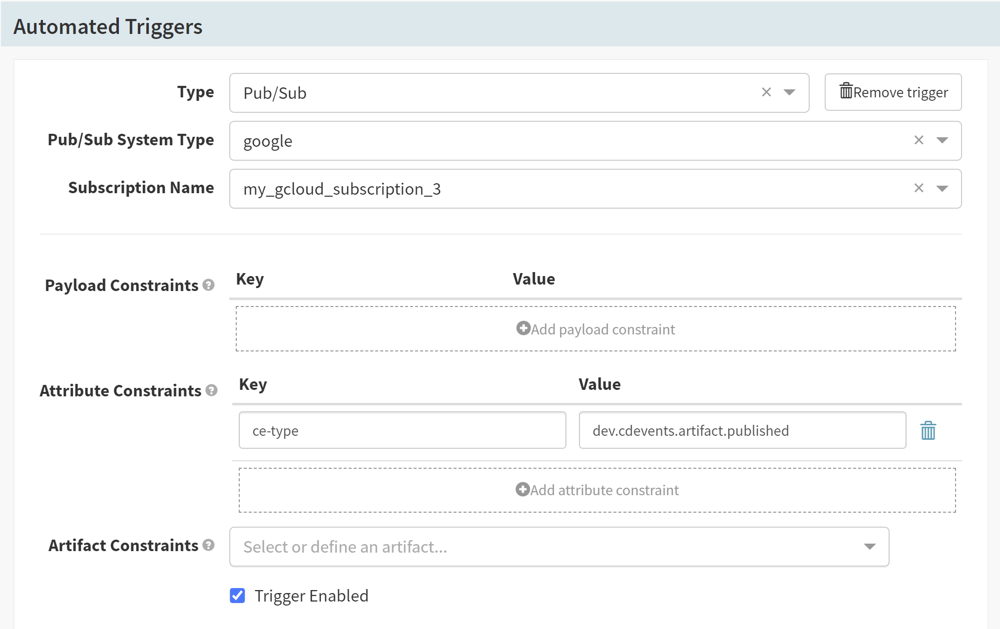
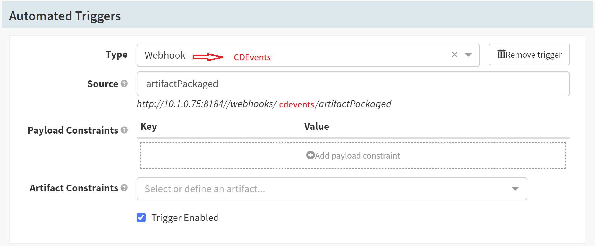
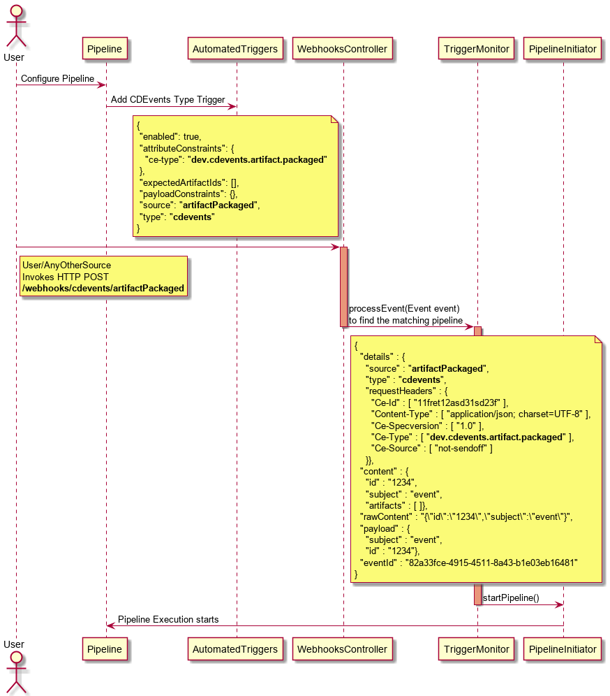
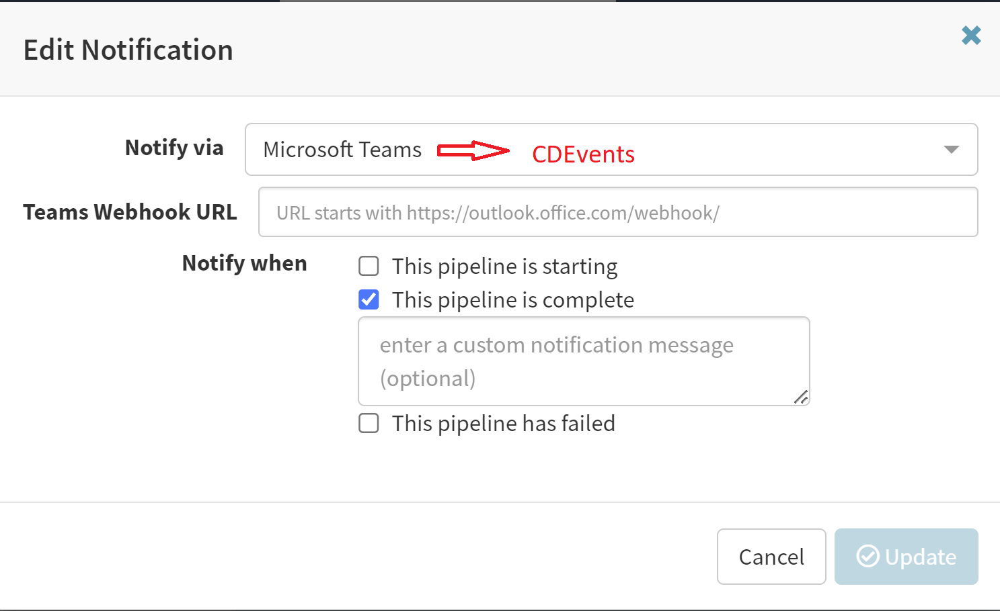
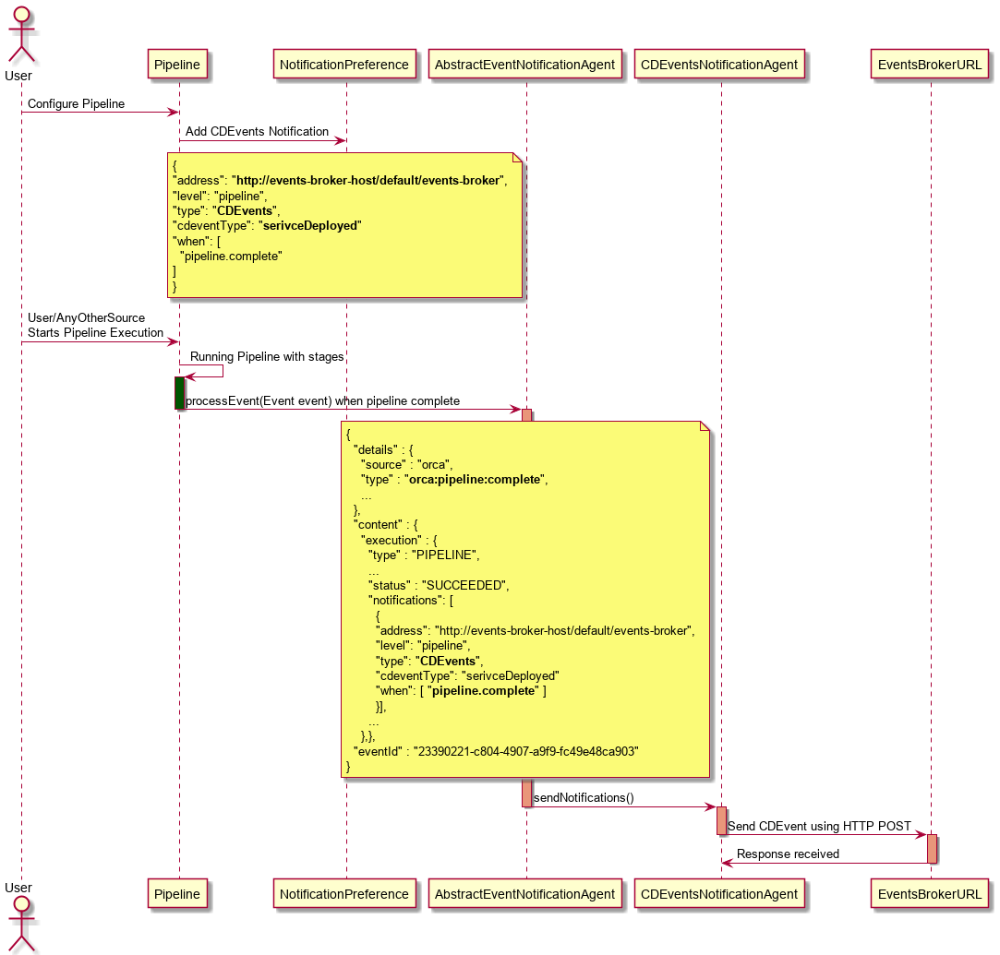
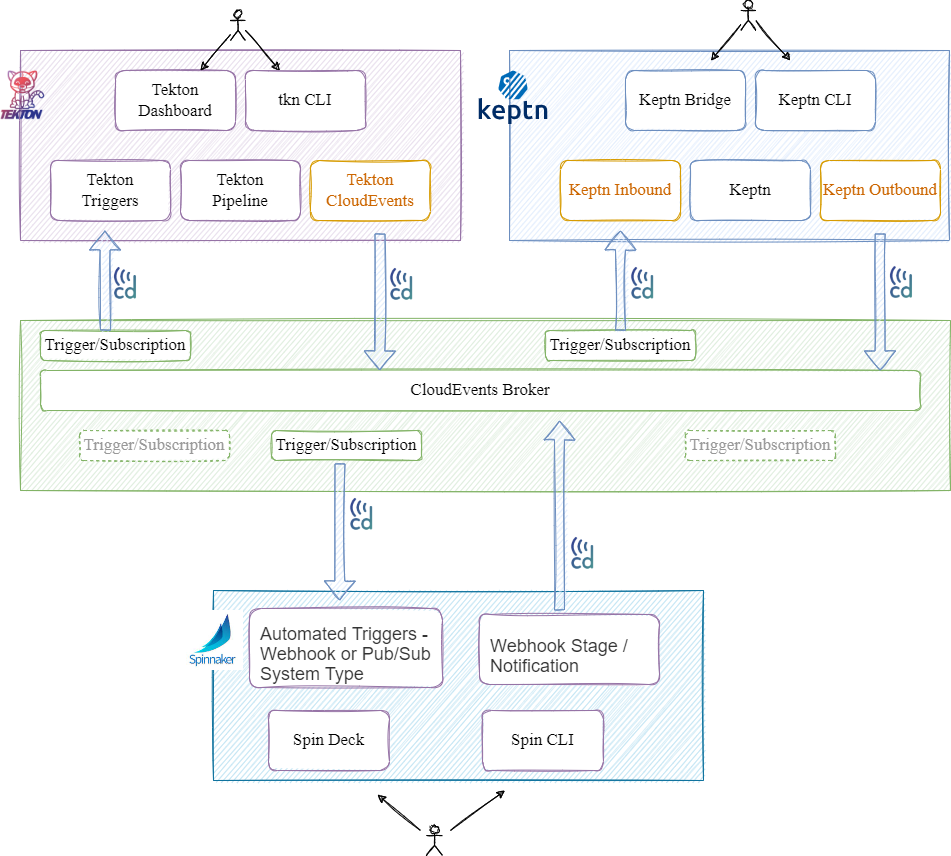

# Implementing CDEvents to Spinnaker using Java SDK


| | |
|-|-|
| **Status**     | _**Proposed**, Accepted, Implemented, Obsolete_ |
| **RFC #**      | _#299_ |
| **Author(s)**  | _Jalander Ramagiri (`@rjalander`)_|
| **SIG / WG**   | CDF-CDEvents, CDF-SIGEvents |

## Overview

Many organisations use more than one CI/CD tools as part of their pipelines and most of the times the organisations implement their own glue code in order to make the tools work with each other.

Implementing [CDEvents](https://cdevents.dev/) to Spinnaker enables Spinnaker to communicate with other CI/CD tools within the ecosystem. [CDEvents](https://cdevents.dev/) is a common specification for Continuous Delivery events based on the [CloudEvents protocol](https://cloudevents.io/).
Spinnaker can produce and consume [CDEvents](https://cdevents.dev/) using [Java SDK](https://github.com/cdevents/sdk-java) which is developed and maintained by the [CDEvents community](https://cdevents.dev/community/).

## Goals and Non-Goals
Goals:
- Event-Driven Standardization with CI/CD tools like Keptn, Tekton, Jenkins, Spinnaker, etc..
- Implementing a new `CDEvents` Webhook type in Automated triggers, to execute the pipeline when CDEvent is received
- Implementing a new `CDEvents` Notification preference to notify `events-broker` via CDEvents
- Spinnaker can able to consume and produce CDEvents from/to `events-broker`
- One needs to subscribe to `events-broker` with the type of event that needs to be consumed by Spinnaker

Non-Goals:
- Creation of API end points to produce and consume CDEvents
- Creating a broker specific implementation to consume/produce CDEvents

## Motivation and Rationale

- Currently there is no common specification for CI/CD tools to communicate with in the CI/CD ecosystem. 

- In a complex and fast-moving CI/CD world with a lot of different tools and platforms that need to communicate with each other.

- Multiple pipelines can be run between CI/CD tools by sharing the artifacts and its metadata.

- Increase in traceability with in the ecosystem from commit to deployment of an artifact.

- Operators can deploy Spinnaker with `CDEvents` to run multiple pipelines using different CI/CD tools with in ecosystem.

## Timeline
The CDEvents integration process will be achieved in two goals:

1. [Introducing `CDEvents` to Spinnaker using existing infra(Pub/Sub Automated triggers and Webhook stage).](##Goal-1)
2. [Integrating `CDEvents` to Spinnaker by implementing a new Webhook type and a new Notification preference for `CDEvents`.](##Goal-2)

The final implementation aligning with `CDEvents` vocabulary specification will take from 4-6 weeks.

## About CDEvents:

CDEvents is a common specification for Continuous Delivery events, it enables interoperability between the CI/CD tools.
CDEvents builds upon CloudEvent by adding CI/CD specific extensions like artifact, build, test, pipeline, repository and environment.

CDEvents specification is described as 4 categories;
1. Core Events - pipelineRun, taskRun
2. Source Code Control Events - repository, branch, change
3. Continuous Integration Events - build, testCase, testSuite, artifact
4. Continuous Deployment Events - environment, service

More detailed information on each of this specifications can be found [here](https://cdevents.dev/).

Schema definitions for each of the CDEvents type with required/optional properties described at [CDEvents Schemas](https://github.com/cdevents/spec/tree/v0.1.0/schemas)

HTTP is the supported protocol of a CDEvents for now and CDEvents are mapped to CloudEvents headers and body using [CloudEvents HTTP protocol binding](https://github.com/cdevents/spec/blob/v0.1.0/cloudevents-binding.md).


## CDEvents PoC Use Case:
Proof of concept with Spinnaker, Keptn and Tekton CI/CD tools developed to communicate with each other about occurrences and running pipelines from building an artifact to deploy.

The use case with the PoC described as below,
1. Tekton builds a new version of docker image and produces `artifact.packaged` CDEvent.
2. Keptn receives `artifact.packaged` CDEvent and be informed about this new image built by Tekton 
3. Keptn decides what to do next following its orchestration manifest.
4. Keptn sends an `artifact.published` CDEvent for the next operation/deployment to be started.
5. Spinnaker receives `artifact.published` CDEvent and runs the deployment Pipeline.
6. Spinnaker sends a `service.deployed` CDEvent once the Pipeline run is Successful. 
7. Keptn receives `service.deployed` CDEvent and mark the deployment 
operation is completed.

[Recording is on YouTube for Events in Action With Spinnaker, Tekton and Keptn Demoed at SpinnakerSummit 2022](https://youtu.be/92Txy-USHg4)

## PoC modules and interactions


## Design

The CDEvents integration will be achieved in two Goals:
## Goal-1: 
### Introducing `CDEvents` to Spinnaker using existing infra(Pub/Sub Automated triggers and Webhook stage):

Using an existing Spinnaker Pub/Sub Automated triggers and Webhook stage `CDEvents` will be consumed/produced and Spinnaker can communicate with other CI/CD tools using CDEvents.

### Consume CDEvents:

CDEvents can be consumed by existing Pub/Sub system types(google/amazon) as CDEvent is build upon CloudEvent and CloudEvent is supported by most of the event providers.

The pipeline can be triggered when a specific event type is received, event type will be included as `ce-type` in the HTTP Header part of the event consumed and it will be configured as one of the Attribute Constraints




### Produce CDEvents

Webhook stage will be configured in a pipeline from which we need to send a CDEvent
 
 

The CDEvent will be received by a `events-broker` configured as Webhook URL.

With this existing Webhook configuration CDEvents will not be fulfilled as additional CI/CD specific extensions can not be added here. This will be achieved by creating a new Notification type `CDEvents` to produce CDEvents using [Java SDK](https://github.com/cdevents/sdk-java) as part of Goal-2 Implementation.

## Goal-2:
### Integrating `CDEvents` to Spinnaker by implementing a new Webhook type and a new Notification preference for `CDEvents`

Implementing a new Webhook and Notification to consume/produce CDEvents by using HTTP binding

### Consume CDEvents:
Implementing a new `CDEvents` Webhook type in [Automated Triggers](https://spinnaker.io/docs/guides/user/pipeline/triggers/pubsub/), to consume  `CDEvents`

### Implementation details:

 - A new `CDEvents` type will be added to the Automated Triggers, that will invoke an existing `Webhooks` endpoint with cdevents type as below
    ```
    /webhooks/cdevents/{source}
    ```
   - where `source` will be any of the (artifactCreated/testSuiteFinished/changeCreated) CDEvent types

   - A Webhook URL to consume CDEvent type `dev.cdevents.artifact.packaged` will be created as
   ```
    http://<SPIN-HOST>:<GATE-PORT>/webhooks/cdevents/artifactPackaged
   ```

   - A new CDEvent type will be created similar to Webhook as below and a pipeline will be triggered for which CDEvents Automated trigger is configured:

   
 
   - Note: A new attribute constraints need to be created and mapped from CDEvents request header to trigger the pipeline when a specific event type is received.
   Event type is included as `ce-type` in the HTTP Request Header part of the event consumed

   - The new endpoint `/webhooks/cdevents/{source}` will receive the `CloudEvent` as input in the body. The CDEvent SDK will extract the necessary information from the headers and payload to run the matching pipeline with any specified configuration.

   - When the Pipeline is saved with the `CDEvents` type Automated Trigger, the trigger will be created as below with the pipeline configuration.

   ```
   {
    "application": "cdevents-spinnaker",
    "id": "36848590-113b-4a00-aeff-5baaa7085691",
    "name": "test-events",
    ...
    ...
    "triggers": [
     {
      "enabled": true,
      "attributeConstraints": {
        "ce-type": "dev.cdevents.artifact.packaged"
      },
      "expectedArtifactIds": [],
      "payloadConstraints": {},
      "source": "artifactPackaged",
      "type": "cdevents"
     }
    ]
    ...
    ...
   }
   ```

   - An example configuration of CDEvents Webhook URL to invoke when a CDEvent `dev.cdevents.artifact.packaged` is produced from any other source to Knative like `events-broker`

   ``` 
    kubectl create -f - <<EOF
    apiVersion: eventing.knative.dev/v1
    kind: Trigger
    metadata:
      name: cd-artifact-packaged-to-spinnaker
    spec:
      broker: events-broker
      filter:
        attributes:
          type: dev.cdevents.artifact.packaged
      subscriber:
        uri: http://<SPIN-HOST>:<GATE-PORT>/webhooks/cdevents/artifactPackaged
    EOF 
   ```
   - When Spinnaker CDEvents webhook receives a CDEvent, it will be invoked with the POST RequestMapping(`/webhooks/cdevents/artifactPackaged`) using `WebhooksController` in `echo-webhooks` project.
    - The CDEvent will be converted to the Spinnaker event (`com.netflix.spinnaker.echo.api.events.Event`), Spinnaker Event may need some changes to convert from CDEvent
    - And the Event will be propagated to the `EventPropagator` to process the request 
    - Using `TriggerMonitor` in `echo-pipelinetriggers` project, the matching pipeline will be triggered by `PipelineInitiator`

      #### Sequence Diagram:

      

    - A sample CURL command to send a `dev.cdevents.artifact.packaged` CDEvent to the Knative like `events-broker` URL.

   ```
   curl -X POST -d '{"id": "1234", "subject": "event"}' -H "Ce-Id: say-hello" -H "Ce-Specversion: 1.0" -H "Ce-Type: dev.cdevents.artifact.packaged" -H "Ce-Source: not-sendoff" -H "Content-Type: application/json" "http://events-broker-host/default/events-broker"
   ```

    

### Produce CDEvents
A new Notification Preference `CDEvents` will be implemented to produce CDEvents using [Java SDK](https://github.com/cdevents/sdk-java).

### Implementation details:
  - A new CDEvents Notification Preference will be implemented parallel to 
Email, Microsoft Teams, slack, SMS what exists today.

    - Using CDEvents type Notification we can send a CDEvent at any stage of the 
pipeline to a specific `events-broker` address entered via updated field `Events Broker URL` as `http://events-broker-host/default/events-broker`

    - A new CDEvent type will be created in Notification Preference as below and a CDEvent will be send to the `events-broker` URL address and will be notified based on the Pipeline status 
    
    

     - Note: A new field for `CDEvent Type` will be created to select the type of CDEvents that needs to be send to the desired `events-broker` via Notification.

    - When the Pipeline is saved by adding a `CDEvents` type Notification Preference, the notifications will be created as below with the pipeline configuration.
    ````
    {
      "application": "cdevents-spinnaker",
      "id": "36848590-113b-4a00-aeff-5baaa7085691",
      "name": "test-events",
      ...
      ...
      "notifications": [
        {
        "address": "http://events-broker-host/default/events-broker",
        "level": "pipeline",
        "type": "CDEvents",
        "cdeventType": "serivceDeployed"
        "when": [
          "pipeline.complete"
        ]
        }
      ]
      ...
      ...
    }
    
    ````

    - When the Pipeline execution is completed an event will be processed using `AbstractEventNotificationAgent` in `echo-core` project and sends the notification for `CDEvents` type.

    - A new implementation class `CDEventsNotificationAgent` in `echo-notifications` will be created by extending `AbstractEventNotificationAgent`
    - CDEventsNotificationAgent builds CDEvent using [Java SDK](https://github.com/cdevents/sdk-java) and sends specifc CDEvent to `events-broker` via HTTP protocol.

    #### Sequence Diagram:
    

    - Example: A sample CURL command to send a dev.cdevents.service.deployed CDEvent to the knative like `events-broker` URL.
    ```
    curl -v -d '{"id": "1234", "subject": "event"}' -X POST -H "Ce-Id: HelloSpinnaker" -H "Ce-Specversion: 1.0" -H "Ce-Type: dev.cdevents.service.deployed" -H "Ce-Source: not-sendoff" -H "Content-Type: application/json" "http://<events-broker-host>/default/events-broker"
    ```

### Functional Diagram
Below is the diagram shows how different CI/CD systems interact with each other using CDEvents managed by single events-broker



### Dependencies

The CloudEvent dependencies(io.cloudevents) are required to implement produce/consume events 

## Drawbacks
CDEvents version 0.1 released recently and it is still in its early stage of life, and changes are expected in terms of specifications and support using CDEvents.


## Prior Art and Alternatives
The existing approach is integration oriented and could sometimes result in outages due to change in implementation of integrated components. `CDEvents` allows users to take a more standardised approach, ensuring efficiency and sustainability while creating and maintaining CI/CD pipelines.

## Known Unknowns

The approach will be demonstrated with the Spinnaker Community using `CDEvents` PoC.

## Security, Privacy, and Compliance


## Operations
Admin needs to configure the Pipelines as below to produce/consume CDEvents through specific `events-broker`

A Pipeline should be configured with an Automated Triggers Type(Webhook or Pub/Sub) to run this Pipeline when specific event type is consumed.

And a Pipeline should be configured with new Webhook stage or CDEvent Notification(as described in Goal-2) to produce a CDEvent on completing a specific Pipeline


## Risks

## Future Possibilities

`CDEvents` open the doors to scalable and decoupled interoperability within the software supply chain and create the potential for greater visibility and measurability of cloud native continuous delivery workflows.
