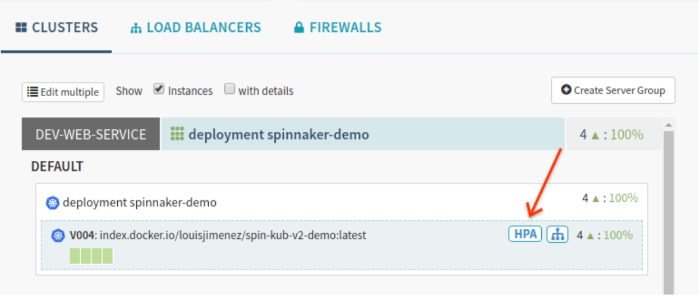
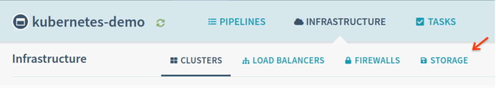
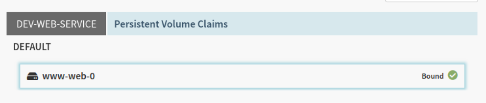
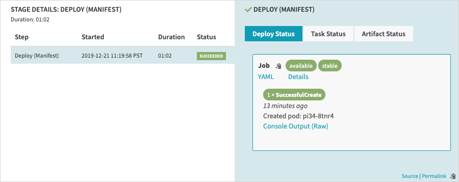
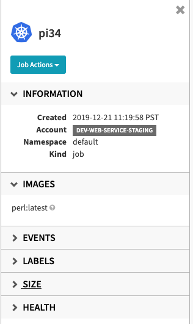

# Kubernetes UI Enhancements

| | |
|-|-|
| **Status**     | _**Proposed**, Accepted, Implemented, Obsolete_ |
| **RFC #**      | [94](https://github.com/spinnaker/governance/pull/94) |
| **Author(s)**  | Louis Jimenez (@louisjimenez) |
| **SIG / WG**   | Kubernetes SIG |

## Objectives

- Reduce the learning curve of Kubernetes by enhancing Spinnaker’s visual representation of deployed objects across clusters.
- Enable the observation and debugging of currently unsupported Kubernetes objects by adding new Spinnaker UI representations.
- Improve Spinnaker's Kubernetes UI by adopting terminology that reflects the nomenclature of Kubernetes.

## Overview

This project is split into two components. The first section covers the building of an enhanced Kubernetes object UI .The second section covers the changes needed as part of the terminology alignment.

## Out of Scope

While comparing Spinnaker’s UI to alternative tools, I identified a set of Kubernetes objects that are rendered with near feature parity. The UI representations of these objects are sufficiently mature and omitted from further analysis:
- Pods
- Replica Sets
- Deployments
- Services
- Ingress

## Kubernetes Objects UI Proposals

### Horizontal Pod Autoscalers

#### Current Functionality

Horizontal Pod Autoscalers automate the scaling of a Kubernetes object’s pod count by monitoring a predefined metric. HPAs continuously observe the CPU utilization of the pods in a Deployment, Replica Set, or Stateful Set and will actuate towards a CPU utilization target. Although Spinnaker’s UI renders the metadata of Deployments, Replica Sets, and Stateful sets, it does not display any information regarding deployed HPAs.

#### Non-spinnaker Tooling

Other Kubernetes UIs frequently render the metadata of an HPA alongside it’s object target. The metadata surfaced often includes:
- Min / Max replica count
- Target CPU utilization
- Current CPU utilization
- Target object
- Duration since the last scaling event

#### Proposal

Adding support for rendering HPA’s to Spinnaker will enable users to quickly discern their pod scaling strategy and make necessary adjustments. Currently, Deployments are rendered without their associated HPA’s. This diminishes the UX of the infrastructure view by obfuscating scaling actions taken by HPA’s. This functionality has been a [longstanding request](https://github.com/spinnaker/spinnaker/issues/3265) from the Spinnaker community and has garnered significant interest.

This can be addressed by:
- Re-using the existing UI panel to surface metadata on utilization, replica counts, and scaling events.
- Visually indicating in the Clusters tab when a Deployment, Replica Set, or Stateful Set is targeted by a HPA. User interaction with the visual indicator will display the UI panel for HPA metadata. The visual indicator will be represented with an icon from the existing Font Awesome set available in deck. Options include:
- [Autoprefixer](https://fontawesome.com/icons/autoprefixer?style=brands)
- [Balance Scale](https://fontawesome.com/icons/balance-scale-left?style=solid)

*A mockup of the Spinnaker UI with an icon indicating that the Kubernetes object is associated with a Horizontal Pod Autoscaler*

#### Vertical Pod Autoscalers

Vertical Pod Autoscalers can be used to provide suggested values for a pod’s CPU and memory requests. VPAs can also automatically apply these recommended values. Similar to HPAs, VPAs can target workloads. there are enough conceptual similarities to extend the aforementioned HPA UI patterns to VPAs and display them in Spinnaker.

### Persistent Volumes

#### Current Functionality

Although Spinnaker supports the deployment of Persistent Volume Claims, both Persistent Volumes and their associated claims are not rendered in the UI.

#### Non-spinnaker Tooling

Other Kubernetes UIs render Persistent Volume Claims and display the association to the underlying volume. This allows users to easily discern the status, access mode, and storage class of a given PVC.

The [Kubernetes Dashboard tool](https://github.com/kubernetes/dashboard) also offers an extensive breakdown of the properties of the underlying volume. A PVC’s backing volume can be examined to determine its reclamation policy, source disk, and storage capacity.

Finally, pods with associated Persistent Volume Claims display a link to the details of the PVC.

#### Proposal

The current UI offers no guidance on the relationship between a Pod, Persistent Volume Claim, and backing volume. The absence of PVCs, underlying volumes, and PVC pod links presents the opportunity to improve users understanding and enhance their ability to debug storage objects from within Spinnaker.

The following set of changes are advised:

- Render Persistent Volume Claims in the infrastructure view of Spinnaker’s UI
  - Expose PVC specific metadata covering the access mode, storage class, and a reference to the underlying volume.
  - Introduce a “Storage” infrastructure tab for rendering cluster level objects such as PVCs.
  - Link to the underlying Persistent Volume for each PVC.
- Render Persistent Volumes under the new Storage tab
  - Expose Persistent Volume specific metadata on the reclamation policy, source disk, and storage capacity.
  - Link back to the underling PVC.
- Update the Pod UI to link to the associated PVC

*The Spinnaker UI with a proposed Storage tab*

*A PVC listing mockup grouped by account and namespace.*

### Config Maps

#### Current Functionality

Similar to its handling of Persistent Volume Claims, Spinnaker supports deploying Config Maps but does not render them in the UI or surface information on Config Map consumers. Other Kubernetes tools often feature a dedicated UI category for reviewing a cluster’s Config Maps.

#### Proposal

Similar to the effort to expose PVCs under a dedicated Storage tab, the UI components can be extended to surface Config Maps. These Config Maps will live in an additional UI tab for Configuration. A Config Maps’ stored data, a YAML viewer, and the following Metadata will be displayed:

- Name
- Namespace
- Labels
- Annotations
- Created timestamp
- Cluster

### Jobs

#### Current Functionality

Although easily accessible in other Kubernetes dashboards, the jobs object is only indirectly viewable in Spinnaker’s infrastructure view. Instead, Spinnaker offers two distinct UI experiences when deploying Kubernetes jobs.

##### Run Job Stage

When executing a pipeline with a Run Job stage, an execution UI is available. The sole Job specific component of this view is a link to the container output.

##### Deploy Manifest Stage

When a Job is deployed using the Deploy Manifest stage, a more robust UI is available. This UI offers details covering deployment events and artifacts.

*The UI for deploying a job through the Deploy Manifest stage*

Additional metadata and job actions can be found by clicking the “Details” link. This takes the user to a panel on the infrastructure page that provides metadata on:

- The job image
- Labels
- Size
- Health

Job actions for editing, scaling, or deleting the job are also available.

*The Job metadata panel as seen in the infrastructure UI*

#### Proposal

##### Display Job metadata on the infrastructure view

The Job metadata panel serves as an effective means of surfacing the status and attributes of deployed jobs. However, it cannot be accessed directly. The metadata panel is not visible to users landing on the infrastructure route. Users must follow a link from a pipeline execution or  manipulate the URL by hand to find a given job. If the job was not deployed using Spinnaker or the execution history is unavailable, no link will exist to view the Job UI. Feedback from Spinnaker users, reveals that there is an expectation that the Job UI panel would appear in the infrastructure view. 

The infrastructure view can be updated to display a list of jobs deployed to each cluster. Selecting a job from this list would then display the job metadata panel. This change would increase the visibility of deployed jobs and make it easier for users to monitor job resources across multiple clusters within Spinnaker.

##### Cron job improvements

Cron jobs have additional attributes that are crucial in understanding how and when a given job will execute. There is a set of attributes present in other Kubernetes tools that is not available in Spinnaker’s Cron Job metadata panel. This includes:

- Execution schedule
- Last scheduled execution time
- Concurrency policy
- Suspension status. 

Surfacing these attributes in the panel would allow users to quickly understand the state of their cron jobs across clusters. They can be added as collapsible windows to the existing panel UI.

### Editing Actions

New objects being exposed as part of this effort will not support editing actions from the infrastructure view. [Discussions](https://docs.google.com/document/d/1db_yw1uru99Byvin4lQgm7aUZ9xMmvsARtEiiNUrmBo/edit#heading=h.g5ms48w4nz3d) with the Kubernetes SIG indicate a preference for not including edit actions in the infrastructure UI and highlighted concerns that it encourages deployment anti-patterns. 

### Daemon Sets / Stateful Sets
#### Current Functionality

Daemon Sets / Stateful Sets are currently rendered in Spinnaker’s infrastructure view. They leverage a similar UI to Replica Sets and successfully convey all key object attributes. Given that the Daemon Set / Stateful Set UI has near parity with other tooling, I recommended leaving this functionality unchanged for this project.

### Namespaces
#### Current Functionality

There is no dedicated rendering of Namespace metadata or associated Resource Quotas in Spinnaker’s UI. Namespace information is only provided as a string identifying where a deployed object resides. While it would be possible to add functionality for exposing associated Resource Quota objects, this feature would be primarily of use to cluster administrators. Refactoring the Spinnaker UI to surface Namespace resource allocation would be of limited use to application teams.

## Terminology Alignment Proposal

### Scope

The changes proposed here are scoped to Spinnaker terminology that is generic and ambiguous when applied to the Kubernetes provider. This is especially problematic in Spinnaker’s infrastructure view where overloaded terms, such as “Clusters”, are misapplied.
Reworking the terminology for pipeline stages is out of scope for phase 1 of this effort. Existing stages are already specific to the Kubernetes provider and render tooltips to guide users on their functionality.

### Prior Art

Special thanks to [demobox](https://github.com/demobox) and [maggieneterval](https://github.com/maggieneterval) whose prior research into Spinnaker's Kubernetes terminology was helpful in drafting these terminology recommendations.

### Terminology Changes

#### Infrastructure view

Cluster → Workloads

Spinnaker uses the term “cluster” in the infrastructure view as an all encompassing term for the metadata, instances, and environments that comprise an application. This term is incongruent with the Kubernetes definition of a cluster. The term “workload” aligns Spinnaker with other tools and accurately refers to the set of Kubernetes application resources.

Load Balancers

The load balancer tab of Spinnaker’s infrastructure view is used to display deployed Service and Ingress objects. While updating this to “Services & Ingresses” would bring Spinnaker into alignment with other tools, it would require further tweaking if the category is expanded to include future object types. Unlike Spinnaker’s overloaded usage of the term “cluster”, the load balancer label is not applied in direct conflict with a pre-existing Kubernetes specific term.

Firewalls →  Network Policies

The firewalls tab of Spinnaker’s infrastructure view is used to display deployed Network Policy objects and can be renamed accordingly.

#### Other UI Labeling

- References to ‘“Instances” in the filter UI panel, the clusters tab, and the load balancers tab will be replaced with “Pods”.
- The term “Zone” is used in the Pod table view and will be replaced with “Namespace”.
- The term “Provider” is used in the Pod table view and will be replaced with “Status”.
- The load balancer and firewall tab have a toggle that is labelled “Show Server Groups”. Both the toggle and its tooltip will be updated to “Show Workloads”. 
- Each UI tab has a dedicated button for directly deploying an unvalidated manifest. These button labels will be updated to reflect the tab name. A future iteration could offer a UI that scopes deployment objects to the tab’s given type.
- Region and Availability Filters can be consolidated to a single filter for Namespaces.

#### Technical Approach

When creating an application, users will be presented with a checkbox for enabling “Provider Specific Terminology”. Upon enabling, users will select the terminology configuration to apply. This will allow each application team to determine what configuration works best for their mix of cloud providers. 

By default, this will not be enabled for existing applications. This will ensure backwards compatibility with pre-existing applications and prevent unexpected terminology changes. 

Initial rollout of this functionality would provide a terminology set tied to the Kubernetes provider but be generic enough to support extension to other cloud providers.

Ideally, this approach will not degrade the UI experience for non-Kubernetes or mix provider setups. It will give users control on an application level and will improve the Kubernetes experience while remaining extensible.

#### Concerns

This approach may introduce a visual flicker during page load. Additionally, making UI terminology configurable at the application level is higher in complexity than an all or nothing approach such as a feature flag option.

##### API

Changes to terminology will be restricted to the UI. Where a mismatch would be introduced by updating a term in the UI, the API documentation will be updated to make note of the difference. Leaving endpoints unchanged will mitigate the risk of breaking current API consumers.

##### Documentation

Codelabs, API documentation, and user guides across Spinnaker.io will require updating. Terminology changes will need to be communicated to the community in advance through:

- Terminology RFC
- The Kubernetes SIG
- Release Notes

## Phase 2

The scope of this project’s first phase has been detailed above. There exists a set of additional Kubernetes objects that may be helpful to expose to Spinnaker users. This section details a second phase of possible enhancements.

## Custom CRDs

Spinnaker currently offers [extension points](https://www.spinnaker.io/guides/developer/crd-extensions/) for advanced users seeking to accomplish a deeper integration with their own Custom Resource Definitions. This functionality offers users the ability to override the default model class for a CRD, implement a custom naming strategy, or offer a custom UI. To accomplish this, users must be comfortable working in Spinnaker’s code base and running a layered build. The complexity of this approach may act as a significant obstacle. Approaches such as general resource browser may present a more accessible alternative.

## Config Map / Pod Relationship

Phase 1 will expose Config Map objects. Phase 2 can surface the association with related Pods and detail what data, such as environment variables, is being used by a Pod.

## Secrets

Secrets are a volume type that can be used to store sensitive information. Due to the similarities they share with Config Maps, it should be possible to extend the Phase 1 UI to display them. Some existing tooling in the Kubernetes space elects not to show data field values. Before exposing these in Deck, it will be necessary to examine Spinnaker’s current authorization architecture [(fiat)](https://github.com/spinnaker/fiat) and design a secure means of rendering sensitive information directly in the UI.

## Additional Terminology Updates

Terminology changes can be expanded beyond the infrastructure view and across Deck's UI.

